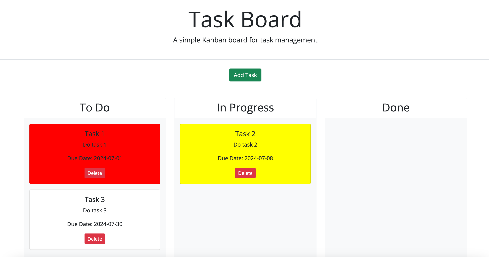

# Task-Board
This Task Board web page allows the user the add tasks that require them to fill in a task name, description, and due date. The tasks can be dragged to the different columns 'To Do', 'In Progress' and 'Done'. When a task is overdue it will appear red. When a task is due soon it will appear yellow.
https://lewisgjohns.github.io/Task-Board/
